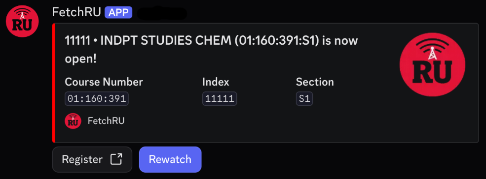
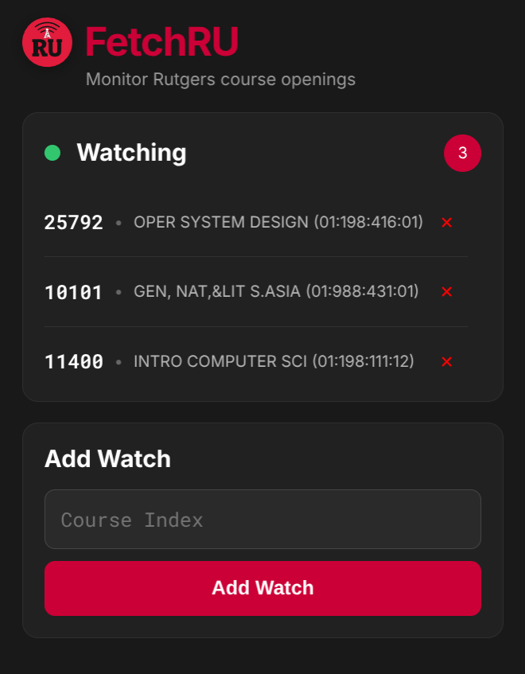

# FetchRU

FetchRU is a Rutgers course monitoring system that notifies students the moment a course section becomes available.

It consists of two components:

- **Discord Bot** – Receive course opening notifications through Discord.
- **Chrome Extension** – Monitor unlimited Rutgers course sections directly from Chrome.

Whether you're waiting for a required class or trying to secure an elective, FetchRU continuously monitors Rutgers' Schedule of Classes and alerts you as soon as a seat opens.

| Discord Bot Preview | Chrome Extension Preview |
| :---: | :---: |
|||
---

## Features

### Shared

- Instant notifications when a course opens
- One-click WebReg registration directly from notifications
- Rewatch courses directly from notifications
- Fast, lightweight, and easy to set up

### Discord Bot

- Monitor up to **20** course sections
- Receive notifications through Discord DMs
- Simple slash command interface
- Hosted **24/7** - no browser required

### Chrome Extension

- Monitor **unlimited** course sections
- Desktop notifications through Chrome
- Simple popup interface
- Works entirely locally - no Discord account required

---

## Installation

### Discord Bot

Choose one of the following:

- **Join the official [FetchRU Discord Server](https://discord.gg/yaTbnGaF6z)** (recommended)
- **Invite FetchRU to your own server: [Invite FetchRU](https://discord.com/oauth2/authorize?client_id=1505780813667762216&permissions=83968&integration_type=0&scope=bot+applications.commands)**

Once you're in a server with FetchRU:

1. Use the provided slash commands (such as `/watch`) to start monitoring course sections.
2. FetchRU will send notifications through Discord Direct Messages.

**One-time DM setup**

Before you can receive notifications, open a Direct Message with FetchRU:

1. Open **Direct Messages** in Discord.
2. Click **Find or start a conversation**.
3. Search for **FetchRU** and press **Enter**.

Once the DM is created, you'll receive course opening notifications there automatically.

---

### Chrome Extension

Install directly from the Chrome Web Store: **[Web Store URL](https://chromewebstore.google.com/detail/fetchru/nmpmcfpnkebiafbgfpcglhefbmaboggi)**

After installation:

1. Pin the extension to your toolbar.
2. Open the popup.
3. Add the Rutgers course indices you wish to monitor.

**Optional setup**

To continue monitoring after closing Chrome, enable:

**Settings → System → Continue running background apps when Google Chrome is closed**

If Chrome remains open, no additional setup is required.

---

## How It Works

FetchRU periodically checks Rutgers' public Schedule of Classes API for course availability.

Whenever a monitored section opens, Discord and Chrome Extension users are both notified.

---

## Technologies Used

- Node.js
- SQLite
- PM2
- Discord.js
- Webpack
- Chrome Extension Manifest V3
- JavaScript (ES Modules)
- Oracle Cloud Infrastructure

---

## Website

Visit the official website: **https://benjamin-gluzman.github.io/FetchRU/**

The website includes:

- Extra installation instructions
- Privacy Policy
- Terms of Service

---

## Privacy

The Discord Bot stores only the information necessary to provide monitoring functionality.

The Chrome Extension stores all watched courses locally using Chrome Storage.

For more information, see:

- [Privacy Policy](https://benjamin-gluzman.github.io/FetchRU/privacy.html)
- [Terms of Service](https://benjamin-gluzman.github.io/FetchRU/terms.html)

---

## Contributing

Issues and pull requests are welcome.

If you encounter a bug or have a feature request, please open an issue.

---

## License

This project is licensed under the MIT License.